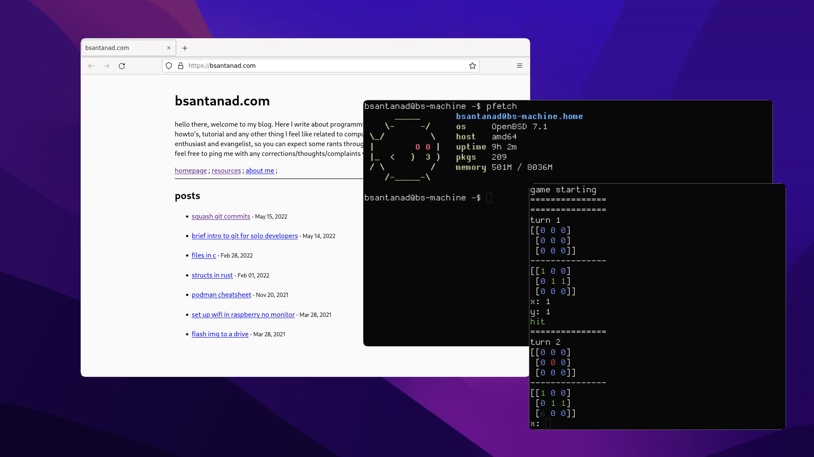

# cwm with rounded corners

I did not make any of the code to make this change, I got it from this repo:
[mlukow](https://github.com/mlukow/OpenBSD-patches)

all the credit goes to him, I literally just applied the patches to the cwm
repo and uploaded it here.

This is for personal use.

This is how it looks with the rounded corners

